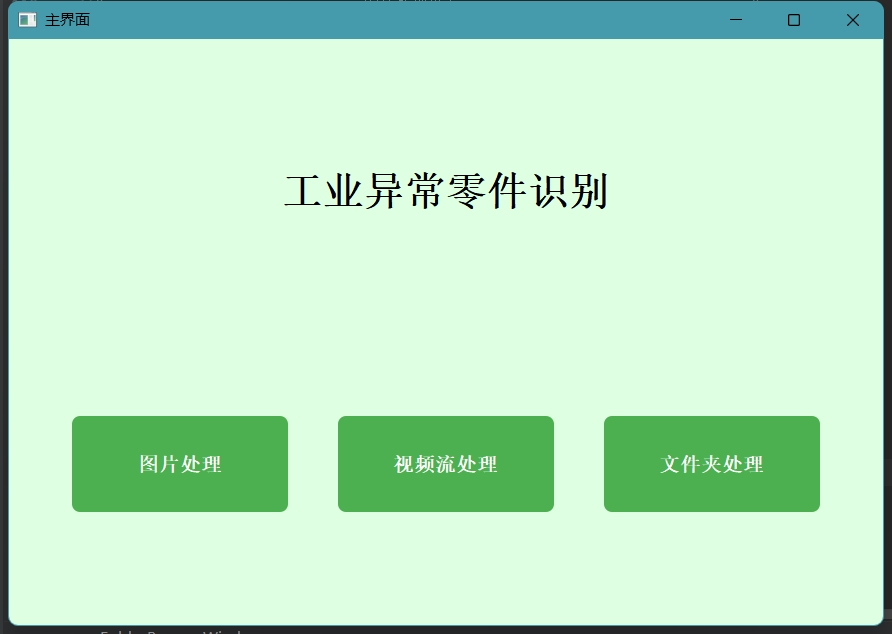
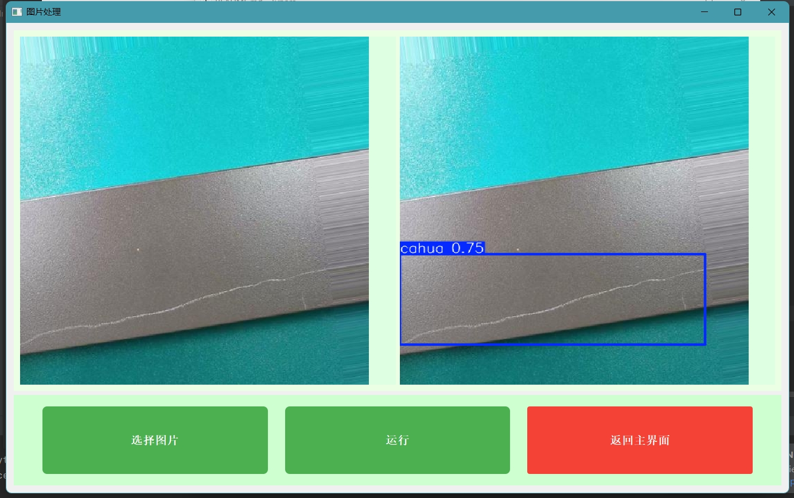
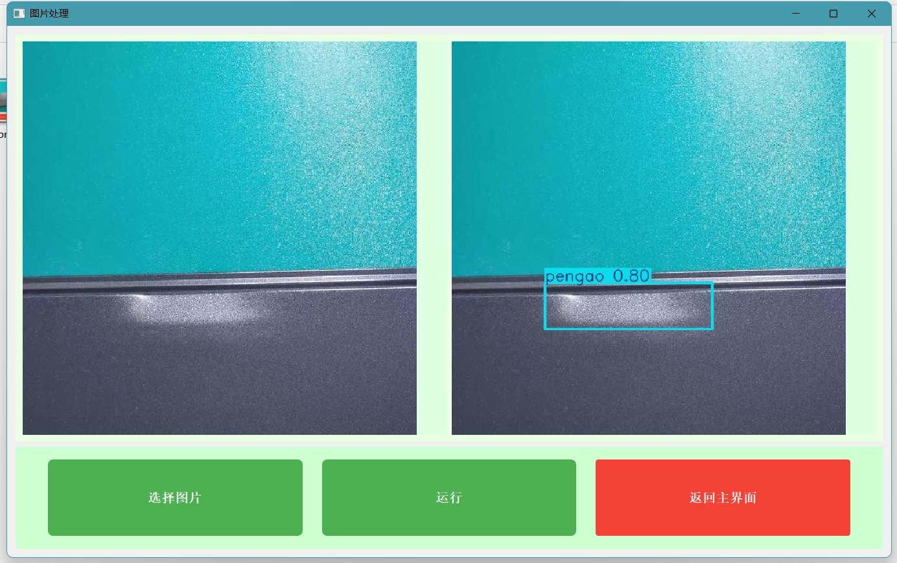
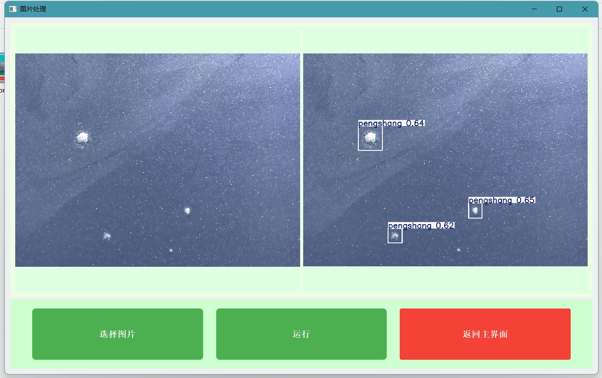
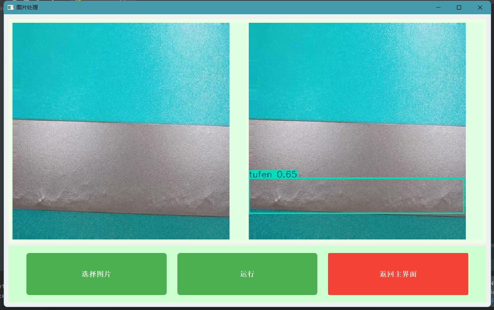
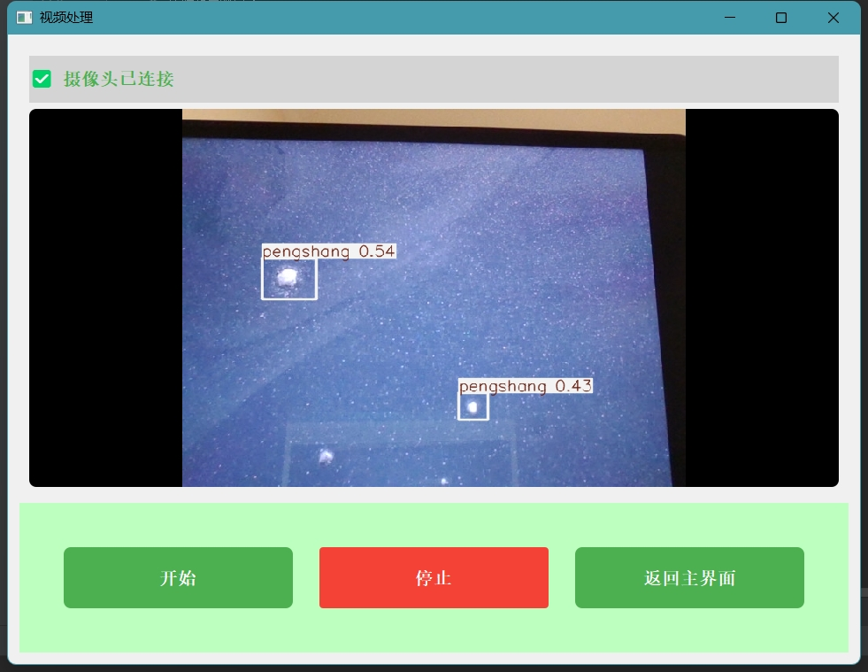
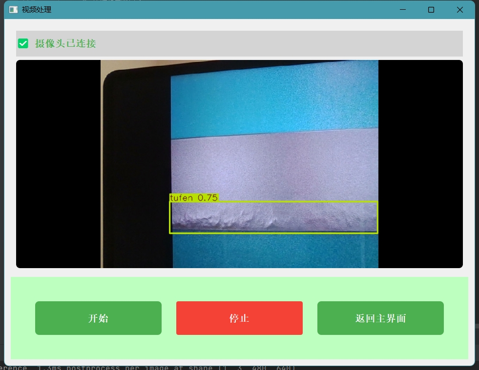
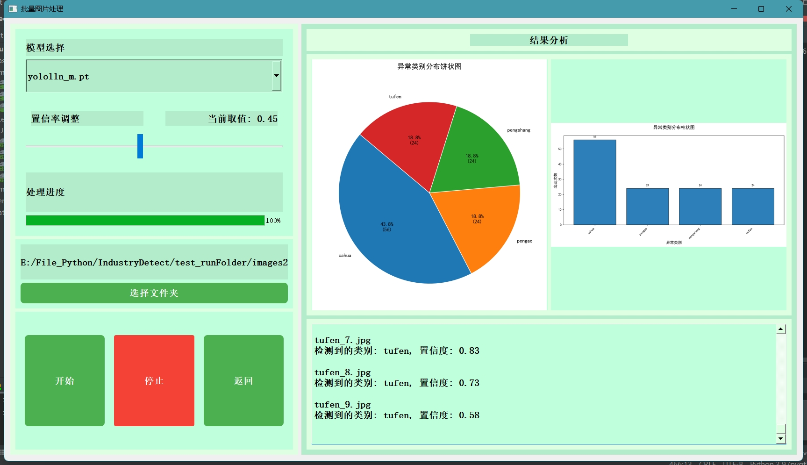

### 项目介绍

使用YOLO11训练自定义数据集，借助PyQt开发一款桌面应用，应用包括3个界面，分别对应处理单张图片、视像头视频实时处理、批量图片处理。

**bvn**里是YOLO格式标注的数据集，主要是铝材图片，训练集+验证集一共1050张；

**IndustryDetect**是工程文件；

* **asset**里面放的图片用来测试单张图片检测页面的
* **model**里面放的是训练过的模型，yolo11n_m是用yolo11n训练得到的；yolo11s_m是用yolo11s训练得到的；
* **test_runFolder**里面两个文件夹用来测试第三个页面，分别有5张、108张图片；页面三在推理完一个文件夹的所有图片之后，会把结果保存在test_runFolder里面，结果文件夹名为detect_result_序号；

开发使用了安全队列实现多线程协作、线程池、多线程并发推理等。后面记录了一些有价值的问题。

项目提供了训练使用的数据集（已标注完成，存放于bvn文件夹中）、应用开发的完整代码、界面的UI文件、训练好的模型。

训练模型的数据集来源于“广东工业智造大数据创新大赛——智能算法赛”https://tianchi.aliyun.com/competition/entrance/231682/information?from=oldUrl。选择了4种缺损类型，分别为**擦花cahua**、**碰凹pengao**、**碰伤pengshang**、**凸粉tufen**，预处理后得到一共1050张图片。

项目结构

```python
IndustryDetect/          # 项目根目录
├─ asset/                 # 窗口1功能测试资源（少量图片）
│  └─ （具体图片文件）    # 用于测试单图处理功能（如窗口1的实时检测/单图推理）
├─ model/                 # 训练过的模型存储目录
│  └─ （模型文件）        #  供推理时加载
├─ test_runFolder/        # 窗口3功能测试资源（批量图片）
│  └─ （批量图片文件）    # 用于测试文件夹批量处理功能（如窗口3的批量推理）
├─ UI/                    # 界面设计文件（4个窗口对应的UI文件）
│  ├─ （UI文件1）         # 对应 MainWindow 类（主窗口）
│  ├─ （UI文件2）         # 对应 ImageProcessWindow 类（图片处理窗口）
│  ├─ （UI文件3）         # 对应 VideoProcessWindow 类（视频处理窗口）
│  └─ （UI文件4）         # 对应 FolderProcessWindow 类（文件夹处理窗口）
└─ main_window.py         # 核心代码文件（实现4个窗口的业务逻辑）
   ├─ MainWindow          # 主窗口类（集成/跳转其他子窗口）
   ├─ ImageProcessWindow  # 单图处理窗口类（对应窗口1，使用 asset/ 图片）
   ├─ VideoProcessWindow  # 视频/摄像头处理窗口类
   └─ FolderProcessWindow # 文件夹批量处理窗口类（对应窗口3，使用 test_runFolder/ 图片）
```

### 桌面应用功能展示

主界面



图片处理页面1：缺损类别为擦花



图片处理页面2：缺损类别为碰凹



图片处理页面3：缺损类别为碰伤



图片处理页面4：缺损类别为凸粉



摄像头检测画面1：



摄像头检测画面2：



批量图片处理页面：可以选择不同模型、调整置信度，根据处理结果，统计缺陷类别的数量信息，生成统计图。



### 开发环境

开发框架：**Python3.9 + PyTorch2.0 + YOLO11**

硬件加速：**CUDA11.8**

开发平台：**Windows11**

界面开发：**PyQt 5.15.9**

开发工具：**PyCharm**

### 实时视频处理窗口

每个窗口的主线程就是UI线程。

**1.点击开始按钮，**主线程创建摄像头线程`CameraThread`，和推理线程`DetectionThread`。摄像头线程每采集到一个帧，就通过槽函数机制，发送给主线程，主线程再将这个帧发送给推理线程，推理线程推理完一个帧之后，通过槽函数将图片发给主线程，主线程显示推理完成的这一帧。

**2.推理线程中定义了一个安全队列**，使用的Python中的`queue.Queue`，这是一个线程安全的队列实现。在多线程环境下，不同线程需要交换数据，借助队列就能安全、有序地实现数据传递。

* 在这里，摄像头线程（`camera_thread`）负责从摄像头捕获帧（数据生产），而 `DetectionThread` 负责对这些帧进行目标检测推理（数据消费）。使用队列可以将这两个过程解耦，使得生产和消费线程可以独立工作，互不干扰。即使某个线程的处理速度发生变化，也不会直接影响到另一个线程。
* 主线程得到摄像头线程传来的帧之后，通过`queue.Queue`类的`put()`方法，向队列放入一个帧， 如果队列已满，该方法会被阻塞，也就是主线程会被阻塞。注意，摄像头线程是不会被阻塞的。推理线程通过`queue.Queue`类`get()`方法，从队列取出帧，当队列为空时，该方法阻塞，即推理线程被阻塞。

**3.如何控制线程的停止？**

通过设置标志位控制线程的停止。两个线程的`run()`方法，都有一个while循环，反复检查标志位`running`是否为`true`。通过主线程点击停止按钮，将两线程的标志位设置为`false`，终止while循环，退出`run()`方法，结束两个线程。

**4.线程间的数据传递，为什么帧的传递非要经过主线程？**

唯一的优点可能就是架构清晰，摄像头线程仅负责采集，推理线程仅负责计算，主线程负责协调和转发，逻辑分层明确。两个线程没有直接的交互关系，不用考虑各种同步处理什么的。

存在的问题，帧数据从摄像头线程→主线程→推理线程，经历两次内存拷贝，耗时增加；主线程需频繁处理信号槽分发和队列操作，可能影响UI响应性；

可以摄像头线程直接与推理线程通信，同时保持线程安全和UI响应性。方法一，依然使用队列摄像头线程直接将帧写入推理线程的队列。其他线程间的通信方式有，共享内存，创建环形缓冲区；双信号槽直连，需要确保线程安全，实现跨线程同步，这个还要兼顾到两个线程的速度，不推荐。

==**5.遇到的一些问题**==

上面提到，推理线程将推理后的图片传递给主线程，这一过程图片以什么格式传递？这里用的是YOLO内置的 `plot()` 方法生成标注图像，`result[0].plot()`方法先返回`numpy.ndarray` 类型的图像数组，再传递`numpy.ndarray`类型，没有问题。最开始传递的是推理结果`result`，也就是张量，发现没法传递，程序到这一步卡死。GPT了一下，Windows下PyTorch的GPU张量能否跨线程传递？回答如下：

1. CUDA上下文绑定线程：
   - Windows中，CUDA上下文默认绑定到创建它的线程。
   - 若在推理线程（子线程）中创建GPU张量，主线程无法直接访问该张量（因上下文隔离）。
2. 信号槽的序列化限制：
   - PyQt信号槽跨线程传递数据时，会尝试序列化参数。
   - GPU张量（`torch.cuda.Tensor`）无法被序列化，导致 隐式崩溃 或 数据丢失。

也就是说，如果一个线程创建了 CUDA 上下文，其他线程要使用该上下文创建的张量时，需要先激活该上下文，这样的话，应该是可以跨线程传递张量的。但是操作复杂，需保证同步且破坏线程安全。

而且第二个问题没法绕开。所以，不推荐直接传递推理结果这种复杂的张量。

6.两个子线程的生命周期

主线程初始化时，两个线程对象（`camera_thread`和`detect_thread`）在主线程所属类（就是 UI 类，这里是`QWidget`子类）的`init_video_system()`方法中创建的，并作为实例属性（`self.camera_thread`、`self.detect_thread`）存储在主线程对象中。只要主线程对象（如窗口）未被销毁（即仍有引用指向它），这两个线程对象就会被持续引用，不会被垃圾回收。

### 批量处理图片窗口

**1.多线程推理的过程：**

先创建一个线程池，定义处理函数（参数是图片路径），将图片和处理函数用`submit()`方法提交给线程池。

**2.停止按钮如何实现关闭线程池所有线程**

正常来说，线程池提供了方法，`self.executor.shutdown(wait=False, cancel_futures=True)`参数解释：

- **`wait=True`（默认值）**：调用 `shutdown` 方法后，会阻塞当前线程，直到所有已提交的任务执行完毕，然后关闭线程池。
- **`wait=False`**：调用 `shutdown` 方法后，不会阻塞当前线程，线程池会立即开始关闭过程，允许当前线程继续执行后续代码。
- **`cancel_futures=True`**：会尝试取消所有尚未开始执行的任务。对于已经开始执行的任务，不会中断它们的执行。
- **`cancel_futures=False`**：调用 `shutdown` 方法后，不会取消任何任务，线程池会等待所有已提交的任务执行完毕后再关闭。

可以看出`shutdown`方法最多只能取消已提交到线程池但 **尚未执行** 的任务（仍在队列中的任务），没法终止**正在执行**的任务。

所以这里新定义了一个变量。

通过`threading.Event()`定义一个变量`self.stop_event`，线程池的处理函数在执行前先检查改变量，如果该变量处于“已设置”状态，函数直接返回，否则执行处理图片相关逻辑。点击停止按钮，将`self.stop_event`设置为“已设置状态”，正在执行的线程监测到`self.stop_event`的状态后，会立即退出，避免继续执行耗时的处理逻辑（如模型推理、文件保存等）。

总的来说：

- **`stop_event.set()` **：确保 **正在执行** 的任务能及时终止。
- **`executor.shutdown()` **：确保 **未执行** 的任务被取消。

**==3.多线程并发YOLO推理遇到的问题==**

* **最开始，只实例化了一个YOLO模型**，多个线程共享这一个模型实例，导致了竞争条件。即由于并发访问，模型的内部状态会被不一致地修改。当模型或其组件持有的状态不是设计为线程安全的状态时，这种情况尤其容易出现问题。所以应该为每一个线程实例化一个YOLO模型。参考文章`https://blog.csdn.net/qq_43755954/article/details/143568684`
* **每个线程实例化一个单独的YOLO模型**，预先为每个线程创建一个模型实例，并在线程本地存储中保存，通过`threading.local()`来实现，每个线程首次运行时加载模型，后续复用该实例。
* **但是，明明每一个线程都有自己的模型实例，**当多线程一起执行时，程序执行到模型这步`results = self.thread_local.model(image_path, conf=self.confidence)`,会卡住，一段时间后程序没有响应，退出；
* **尝试找问题**
  * **将线程池的容量只设置一个线程的话，程序正常执行；**所以肯定是多线程推理时，发生了死锁；
  * **如果设置多个线程，但是在每个线程初始化时加载模型加载到CPU上**，多线程可以正常执行
  * 也就是说，如果是GPU推理+多线程，会发生死锁。GPT一下：
    * **原因1**，CUDA上下文创建冲突：当多个线程同时尝试初始化CUDA上下文时，可能会引发竞争条件，导致死锁或卡住。GPU场景：PyTorch的CUDA上下文是 线程局部（thread-local） 的，但首次创建时会触发全局锁。当多个线程 **同时首次调用CUDA操作**（如加载模型），会触发多次上下文创建，导致死锁。而CPU场景：无CUDA上下文机制，线程可自由并发。解决方法：在主线程中先进行一次空的CUDA操作，确保CUDA上下文在主线程中初始化，子线程继承该上下文。这样可以避免多个子线程同时初始化CUDA导致的冲突。
    
    * 很遗憾，这样做了，没有解决问题。继续找。
    
    * **原因2**，偶然发现每个线程在执行初始化函数时，都先清理了一下显存`torch.cuda.empty_cache()`,这个函数的作用是清空 PyTorch 维护的显存缓存池，将缓存池中的显存归还给 CUDA 运行时库。CUDA 上下文是进程级共享资源：在 PyTorch 中，所有线程共享同一个 CUDA 上下文，这意味着显存管理操作（如分配、释放）是全局的，而非线程独立的，`torch.cuda.empty_cache()` 会清理 **整个进程内未使用的显存缓存**，而不仅仅是当前线程的缓存。多个线程同时调用此函数时，会导致全局显存状态被反复修改。`torch.cuda.empty_cache()` 的设计初衷是 **单线程环境下手动优化显存**，而非用于多线程场景。在多线程中滥用此函数会导致：全局锁竞争，引发死锁或阻塞。
    
    * 注释掉这一行，程序真的能跑起来了！感概自己画蛇添足，多写一行代码让我多耽误了三小时，不过总是解决了，美滋滋去吃饭。结果吃个饭回来再跑一次，程序又在那一步卡住了...
    
    * **原因3**，多个线程推理时，共享同一个CUDA流，引起问题；
    
    * CUDA流是GPU上的任务队列，同一个流内部的操作的是顺序执行的；一个GPU默认隐式创建一个流；例如两个线程内部有推理、后处理两个操作，后处理需要保证所有线程的推理任务全部结束；线程A执行推理，会提交任务到CUDA流，此时线程A获取锁；线程B提交任务被阻塞，无法完成推理，导致A无法完成后处理操作，无法释放锁，二者无期限被阻塞；
    
      显式创建多个CUDA流，将每个线程绑定到独立的流上；
    
      验证结果：流隔离未能解决死锁问题；
    
    * 没办法了， 要想用GPU推理，那就加个锁。`with self.model_lock:  results = self.model(image_path, conf=self.confidence)`，这次是真的可以了。不过加锁就增加了性能开销，还会影响线程的并发。很无奈。

### Python线程池相关

**1.怎么控制所有线程同时关闭或者启动**

`self.stop_event = threading.Event()`，`threading.Event()`是同步原语。它的对象内部有一个内部标志，这个标志可以处于 “已设置”（set）或者 “未设置”（clear）两种状态。

- **`set()`**：把内部标志设置为 “已设置” 状态。一旦标志被设置，所有正在等待该事件的线程都会被唤醒。
- **`clear()`**：将内部标志重置为 “未设置” 状态。
- **`is_set()`**：检查内部标志是否处于 “已设置” 状态。若处于该状态则返回 `True`，反之则返回 `False`。

线程池的线程处理函数时，将self.stop_event作为线程运行的条件，就可实现所有线程的停止和启动。

**2.怎么实现每个线程拥有自己独立变量空间？**

`self.thread_local = threading.local()`，创建了一个线程局部存储（Thread Local Storage，TLS）对象，线程局部存储是一种机制，允许每个线程拥有自己独立的变量副本，各个线程对这些变量的操作互不影响。虽然不同线程访问的是同一个 `threading.local()` 对象，但每个线程在该对象上设置和获取的属性值是相互独立的。

`threading.local()` 创建的对象是一个特殊的对象，它可以为每个使用它的线程维护一份独立的状态。当一个线程首次访问这个对象的属性时，该属性会被绑定到当前线程的上下文中；不同线程对相同属性名的操作实际上是在操作各自独立的副本。

通过使用线程局部存储，可以在多线程环境中安全地管理每个线程的状态，避免不同线程之间的数据干扰。

**3.为什么使用线程池管理多线程，这个创建的线程池，不需要专门定义run()方法吗？**

当需要同时处理多个任务时，创建和销毁线程会带来一定的开销。线程池可以预先创建一定数量的线程，这些线程可以重复使用来执行多个任务，从而减少线程创建和销毁的开销，提高程序的性能。`ThreadPoolExecutor` 就是实现线程池功能的一个工具。当使用线程池的 `submit()` 方法时，只需要定义一个处理函数，然后将该函数及其参数传递给 `submit()` 方法即可。线程池会负责管理线程的创建、复用和销毁，无需关心线程的生命周期管理。

**4.使用线程池的基本步骤**

```python
# 1创建一个线程池
self.executor = ThreadPoolExecutor(max_workers=4, initializer=self.worker_init, initargs=(model_path,))
# 存储线程处理任务的对象
self.futures = []
# 2定义处理函数...
''''''
# 3提交所有任务到线程池
for image_path in image_files:
    # self.executor线程池 的submit()方法将一个可调用对象（process_image 函数）和其参数（image_path）提交到线程池中进行执行。 submit() 方法会立即返回一个 Future 对象，这个对象代表了异步执行的任务。
    future = self.executor.submit(process_image, image_path)
    self.futures.append(future)
```

在 Python 的 `concurrent.futures` 模块中，`Future` 是一个表示异步任务的对象，用于封装异步执行的结果、状态和操作。当你向线程池（`ThreadPoolExecutor`）或进程池（`ProcessPoolExecutor`）提交一个任务（通过 `submit()` 方法）时，会返回一个 `Future` 对象，它代表该任务的执行状态。


#### 3. **修正 thread_local 的使用方式（关键！）**

`self.thread_local = threading.local()`，创建了一个线程局部存储（Thread Local Storage，TLS）对象，每个线程通过类属性self.thread_local加载模型，虽然不同线程访问的是同一个 `threading.local()` 对象，但每个线程在该对象上设置和获取的属性值是相互独立的。

